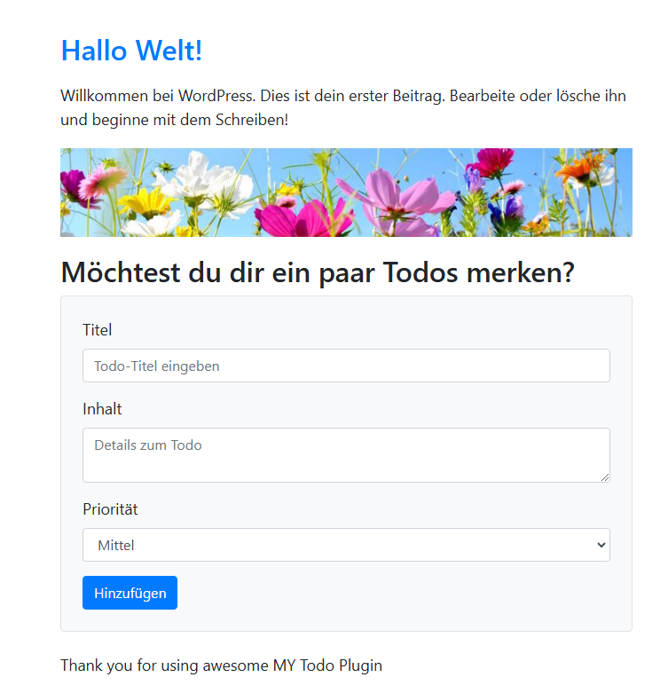
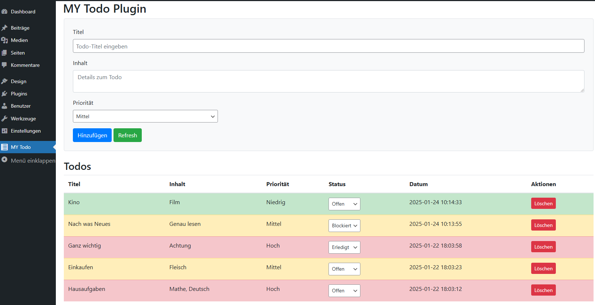

# Simple Wordpress Todo Plugin

Never forget important things anymore.
Use the Todo Plugin reminder on your Wordpress site.
Supports different alert levels and status.

To actvivate add the ShortCode 'my_todo_form' to your Worspress Website.\
Based on Wordpress 6.7.1

## Frontend 

## Backend

